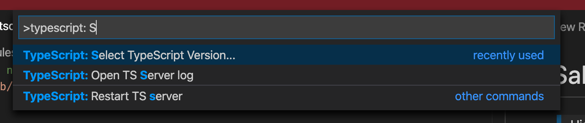
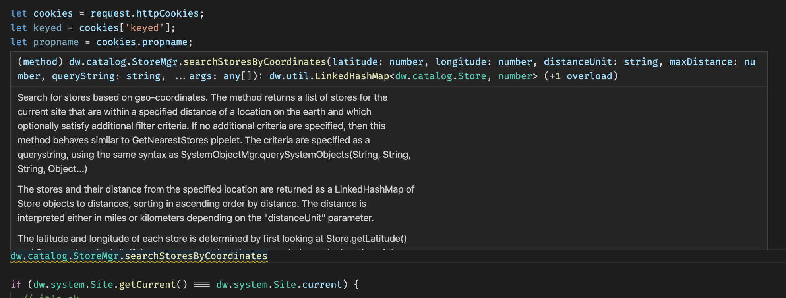

# Salesforce Commerce Cloud type definitions

> High quality Salesforce Commerce Cloud type definitions. A dw-api-types. "done right"

<div>
	<br>
	<a href="https://openmindonline.it" target="_blank"></a>
	<br>
	<br>
</div>

## Features

`sfcc-dts` provides full typeScript definitions for Salesforce Commerce Cloud apis, plus a typescript plugin for resolving requires using "*" cartridge path and a fancy wizard for setting up your project.

The aim of the project is to provide *fully working typescript compilation of commerce cloud server side javascript*.

> Wait, why is this better than the official dw-api from salesforce?

Well, tons of reasons:
* dw-api definitions are largerly incomplete
* dw-api definitions are often wrongly defined in terms of static properties/methods
* dw-api are not documented. sfcc-dts has *full documentation for classes, methods, properties, parameters and return types*
* dw-api is not actively updated when new API gets released. Instead, sfcc-dts definitions are *automatically generated by parsing the public salesforce documentation*, so they can easily be kept up to date

## Installation

Using the wizard:

```bash
$ npm i -g sfcc-dts
```

From your sfcc project root directory type:

```bash
$ sfcc-dts-setup
```

The wizard will guide you for adding required dependencies to `package.json`, setup a working `tsconfig.json` and configure a customizable dw types entry point for your project.

## vscode setup

Vscode will fully benefit from the typescript configuration from `tsconfig.json` only when is configured for using the workspace version of typescript.

For enabling it press [cmd]+[shift]+P -> "TypeScript: Select TypeScript version" and select "Use workspace version" with the version pointing to the node_modules/typescript dir in the workspace.



If the "TypeScript: Select TypeScript version" option or the expected directory dooesn't show up, just open the node_modules/typescript/bin/tsc file inside vscode and retry, this is usually enough to make vscode detect the available typescript installation.



## Usage

If everything goes well you will see autocomplete and validation working in your existing javascript files. Typescript will fully detect:
* requires using `dw/system/Site` syntax
* cartridge requires using `*/cartridge/somefile` or `~/cartridge/somefile`
* fully qualified class names such as `dw.system.Site`
* dw globals such as `request`

## Todo

Still in the checklist:
* automatic generation of type definitions from custom attributes parsing metadata xml
* proper testing, this is still in beta anyway...

## License

Copyright (c) 2020 openmind

Released under the MIT license.
